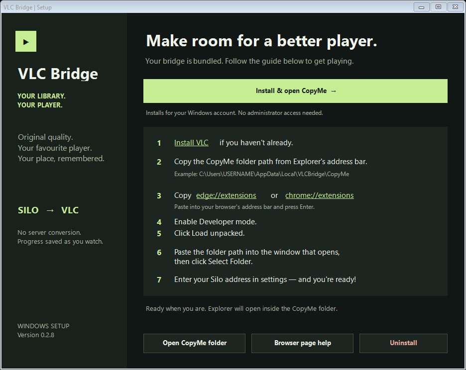

# VLC Bridge for Silo

**Your Silo library. Original 4K files. Played in VLC.**

VLC Bridge connects the [Silo media server](https://siloserver.org/) web interface to VLC on Windows. Press Play in Silo and the original media file opens in VLC, with playback progress synced back to your server.

## Why this exists

This project started because playing native 4K media through a browser wasn't working well for my library. Browsers can play 4K, but resolution is only part of the story: support for containers, HEVC, HDR/Dolby Vision, and audio formats such as DTS varies across browsers and devices. A file that plays in VLC may need conversion—or refuse to play—in the web player.

I wanted to keep browsing my library in Silo and let VLC handle playback. **The server streams the original file: no server-side transcoding, remuxing, or quality conversion.** VLC decodes the media and handles its presentation locally.

This doesn't add Dolby Vision support to VLC or guarantee every file will display correctly. Playback still depends on VLC, your hardware, and your display.

## Download

**[Download the Windows installer](https://github.com/DanielVNZ/silo-vlc-bridge/releases/download/v0.2.8/VLC-Bridge-Setup-0.2.8.exe)** · [All releases](https://github.com/DanielVNZ/silo-vlc-bridge/releases)

You only need the installer EXE. It bundles the browser extension and Windows companion. No PowerShell scripts or extension IDs to copy. VLC itself is installed separately.



## What it does

- Opens Silo playback in a dedicated VLC instance from Chrome or Edge.
- Requests the original selected media file and refuses converted playback routes.
- Lets you configure your own Silo server address.
- Resumes from the position supplied by Silo.
- Saves progress roughly every ten seconds, on pause/resume, and on stop or close. Silo applies its own completion/watched rules.
- Shows sync status in extension settings and reports connection or authentication failures.
- Includes an uninstaller that removes the installed `VLCBridge` folder and launcher registrations.

## Requirements

- Windows with .NET Framework 4 and Google Chrome or Microsoft Edge.
- [VLC media player](https://www.videolan.org/vlc/) installed in its standard Program Files location.
- Access to a Silo server supporting API v2 and playback protocol v3.
- Permission on your Silo server to play the original media file.

## Setup

1. Install VLC if you haven't already.
2. Run **VLC-Bridge-Setup-0.2.8.exe** and click **Install & open CopyMe**.
3. Explorer opens inside the extension folder. Copy its address from Explorer's address bar. It will look like `C:\Users\YOURNAME\AppData\Local\VLCBridge\CopyMe`.
4. In setup, click `edge://extensions` or `chrome://extensions` to **copy** the address. Paste it into your browser's address bar and press Enter.
5. Enable **Developer mode**, then click **Load unpacked**.
6. Paste the CopyMe path into the folder picker and click **Select Folder**.
7. Enter your Silo server address in the extension settings page and save the connection. Grant access to that server when prompted.
8. Click **Check connection**, reload your Silo tab, and press Play.

Keep `CopyMe` in its installed location. The extension isn't published in a browser store, so loading it unpacked is required. The installer is currently unsigned.

**Keep Chrome or Edge running while watching for progress sync.** The Silo tab itself can be closed. Choose audio and subtitle tracks inside VLC.

## Updating

Close VLC playback, run the newer installer, then click **Reload** on VLC Bridge in your browser's Extensions page. Refresh Silo and start playback again.

If you used an early build with a folder called `extension`, remove that browser entry and load `CopyMe` instead. You may need to enter your Silo address again.

## Uninstalling

Close VLC playback and click **Uninstall** in setup, or uninstall **VLC Bridge for Silo** through Windows Installed apps. Setup closes and starts a temporary cleanup helper that deletes `%LOCALAPPDATA%\VLCBridge`, including `CopyMe`, the launcher, and the installed setup executable. It then removes the launcher registrations.

Remove the extension entry from Chrome or Edge afterward. The cleanup helper may leave its temporary executable in the Windows temporary directory. If files are locked, the uninstaller reports a failure; close other setup windows, VLC, and the browser, then try again.

## Limitations and troubleshooting

- **Original files only.** Server policies still apply. If Silo requires an HLS adaptation, the bridge refuses it instead of switching to a converted stream.
- **Same server origin.** Separate streaming-worker hosts and custom stream headers aren't supported.
- **Progress depends on the browser and login.** Closing the browser stops syncing. Expired authentication or an unavailable server can interrupt saves. Check the sync status, sign in again, and reopen playback if needed.
- **Not every playback feature is integrated.** Separate subtitle files and watch parties aren't supported. Opening another media item in the tracked VLC instance ends syncing for the previous Silo session.
- **A small final-position gap is possible.** The companion samples VLC about once a second; crashes can lose recent progress.
- **Browser error after handoff.** Silo may show an “Opened in VLC” error because the bridge intentionally prevents its internal player from starting too.

When reporting a problem, include your browser, VLC version, Silo version, and the error message. **Do not include passwords, access tokens, or signed stream URLs.**

## How it works

The extension intercepts Silo's playback-start request and declares VLC's original-file playback capabilities. It passes the authenticated stream URL to the native Windows companion, which launches VLC with a password-protected control interface bound to `127.0.0.1` on a random port.

The companion reads VLC's playback position. The extension sends sequenced progress updates and a final stop request to Silo, preserving the current account/profile context. Updates are serialized and transient failures are retried.

## Data handling

- Your server address and the latest sync-status message are saved in browser extension storage.
- The extension uses your existing Silo session. It does not ask for or save your Silo password.
- API authorization headers are held in browser memory while syncing. The authenticated media URL is passed to VLC on its command line, so other software with sufficient local access may be able to inspect it.
- Requests go to your configured Silo origin. The extension contains no analytics or third-party telemetry.
- Server access is requested when you configure the extension, rather than granted for every site at installation.

## Building from source

End users should download the EXE. For development, clone this repository and run the following from Windows PowerShell:

```powershell
powershell -NoProfile -ExecutionPolicy Bypass -File .\build.ps1
```

This uses the Windows .NET Framework C# compiler, builds the companion, embeds it with `CopyMe` into a single installer, and writes the result to `dist`. It doesn't install anything or require external build packages.

Optional progress-sync tests require Node.js:

```powershell
node tests/sync.cjs
```

The source is split between `CopyMe/` (browser extension), `host/Launcher.cs` (VLC companion), and `host/Setup.cs` (installer/uninstaller). Windows launcher protocol version `0.2.0` is independent of the extension/package version.

## Project status

An early personal project, tested with the author's Silo setup. Compatibility with every Silo build and media format is not guaranteed. This is an independent integration, not an official Silo or VideoLAN product. VLC is not bundled.

